<!--
author: luodx
head: 
date: 2016-09-18
title: 特效动画的播放机制
tags: render 
category: cocos2d-x
status: publish
summary: 我们来谈谈特效实现
-->

<!-- 
 -->
## 一. 简介 

动画在**2D**游戏里用得十分广泛, 根据这些动画的特点,我们可以大概归为3类

### 1. 粒子动画 

这种动画是由几百甚至上千个粒子构成, 所有粒子都共享一个纹理,  这些粒子都是从一个发射器发出, 加以一定的随机因素, 在不同发射速度和重力等外力作用下,每个粒子呈现不一样的运动状态, 大量粒子可以组合成各种各样不一样的效果, 比如烟花, 火焰. 粒子动画的实现一般都会使用批次渲染和对象池来保证性能.

### 2. 骨骼动画 

这种动画通常用于表现有多个动作的角色,  它通常是由骨骼(bone)和绑定在骨骼上的蒙皮(skin/mesh)构成. 

动画师通常在spine(2d)或者3dmax等工具里面对骨骼动作进行设计, 同时对蒙皮进行编辑.

### 3. 特效动画 

特效动画不需要或者难以使用骨骼进行表达, 比如一个刀光效果或者一闪一闪的星星, 我们可以使用最原始的实现方式, 对动画的每一帧都画一张图片, 依次连续展示这些图片就可以达到动画效果.

但是这种方法实现的动画过于浪费空间和内存.  其中有非常多的特效我们可以通过***关键帧动画***的方式来实现,  常使用***Flash***工具进行关键帧动画的设计.

本文中下面只讨论关键帧动画的实现.

## 二. 关键帧动画介绍 

### 1. 动画举例

我们先来看下面这样一个动画:

动画设计师进行编辑的时候, 是这样的:

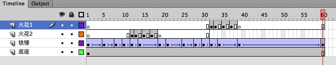

设计师把动画分成了4层, 每一层里带有黑色小点的就是关键帧, 

* **底座**: 这一层就只有一个关键帧, 放入了一个静态的底座图片
* **铁锤**: 这一层就放了一个铁锤, 铁锤在每个关键帧里都具备不同的位置和角度, 在动画播放过程中, 在2个关键帧之间的铁锤的位置和角度, 自动进行插值运算, 这个地方一般使用**线性插值**, 也可以使用更复杂的贝塞尔曲线插值.
* **火花2**: 前面几帧是空白的,到后面铁锤敲打在底座上时, 会在后面几帧产生火花, 由于这几帧火花使用的都是不同的图片, 而且间隔最多1-2帧,所以这个地方不需要进行插值运算
* **火花1**:  同火花2

### 2. 关键帧动画的好处

从上面的一个动画分析,我们可以看到关键帧动画的好处:

* 节省了资源
* 动画分层设计, 逻辑清晰

### 3. 关键帧动画的适用范围

我们可以看到 2个关键帧之间, 元件可以对下面的几种属性进行插值计算从而实现动画的平滑过渡:

*  位置(x,y)
*  旋转和倾斜(rotation/skew) 
*  缩放(scale)
*  透明度(alpha)
*  颜色(color-rgb)

如果我们要做的动画不在上面说的这几种范围内(比如对元件进行Z轴翻转), 那么就不适合使用关键帧动画.

## 三. 播放机制的实现

### 1. 特效结构图

从flash编辑器里的动画分层图, 我们可以直接脑补出以下这张结构图:

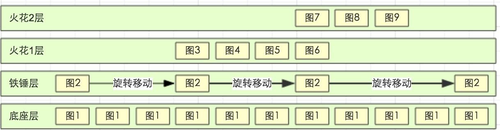

### 2. 播放步骤

#### 1) 创建4层空的容器层
#### 2) 一帧一帧往后解析, 对于每一个容器层
 *  容器层当前为空时, 如果遇到关键帧则创建该关键帧对应图片放入
 *  容器层当前不为空, 预先判断下一个关键帧内容, 
    *   如果下一个关键帧是对本帧图片进行了属性修改(5种属性), 那么根据当前帧位置进行插值计算, 修改本帧图片的属性
    *   如果下一个关键帧是只是更换成另外一张图片,那么本帧保持不变直到播放到下一个关键帧时替换图片
    *   如果当前帧遇到空白帧, 则删除容器里的所有内容
    

### 3. cocos2d-x的实现

对于容器层我们不需要创建实际的显示节点,  我们可以画出一个特效动画在某一瞬间的显示树结构:

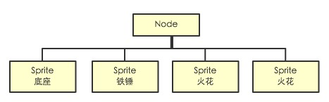

## 四. 性能优化

### 1. 使用纹理集 textureAtlas

我们可以把以上例子中使用到的散图, 整合到一张大图上(sprite sheet), 减少多次的io读文件, 让动画播放更加流畅, 也为下一步的批次渲染优化打下基础.

### 2. 尽可能的批次渲染

我们知道在opengl进行绘图的时候, 如果我们几个图形都有一样的显示状态( 纹理, shader及其uniform参数, blend方式), 那么我们通过一次draw就可以同时画出这几个图形.

在cocos2d-x v3.x版本里, 底层会自动做判断合并多次draw为一次批次渲染, 而在v2.x里, 我们需要自己实现, 一个小成本的做法就是, 当判断可以批次渲染的时候, 在原本Node.addChild(sprite)的地方,  给改成 batchNode.addChild(sprite)即可.

渲染树结构如下:

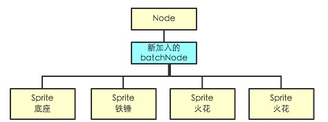

### 3. 合理使用对象池

如果特效是长时间的不断的循环播放, 那么我们在remove元件的时候, 最好不要马上销毁, 可以把它放入一个对象池里, 需要使用的时候,重新初始化元件拿出来使用就可以了.

 
## 五. 功能扩展: 嵌套子特效

为了节省资源, 动画设计师可能会在某一层里放入以前做过的另外一个特效, 我们可以简单的调整代码就可以做到嵌套播放,  播放时的一个渲染树结构如下:

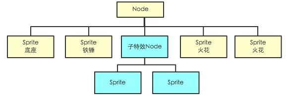

由于子特效很可能使用跟父特效不一样的纹理,  如果我们仍旧想使用批次渲染,

我们有2种做法:

 * A. 动态合并特效纹理:  除非我们有太多的draw call需要合并, 不然动态合并纹理的开销明显不合算
 * B. 尽可能把使用相同纹理的相邻层(个数超过1个才有合并的意义)进行批次渲染
 
我们选择***B***做法,那么调整过后, 渲染树结构如下:
 
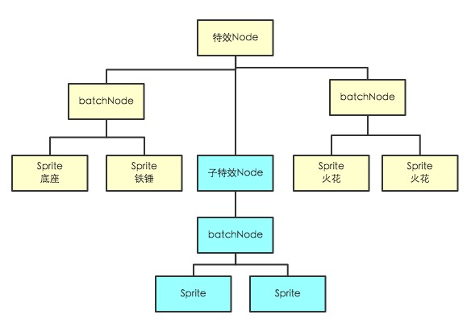

## 六. 功能扩展: 动态子元件

考虑如下场景:  

动画师设计了个抽卡动画特效,  他在设计的时候, 卡牌是画死的, 但是我们在游戏里使用这个特效的时候, 需要这个卡牌可以**动态替换**成我们要的卡牌.

要做到这个功能也不麻烦, 需要:

 * 在导出特效的时候, 需要剔除掉这个画死的卡牌图, 免得浪费资源, 同时对这个资源做一个标记, 表示这个元件需要外部创建
 * 在实现播放特效的代码里, 在创建元件的地方(通常我们会使用工厂模式来实现), 发现某元件是需要外部创建的, 那么调用之前埋入的外部创建器进行元件生成

## 七. 功能扩展: 遮罩实现

考虑以下的动画效果:

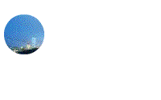

动画分2层,  下面一层是背景图层, 上面一层是一个圆形遮罩, 圆形遮罩会做一个从左到右的移动, 而只有在圆形覆盖下的背景区域才会显示出来.

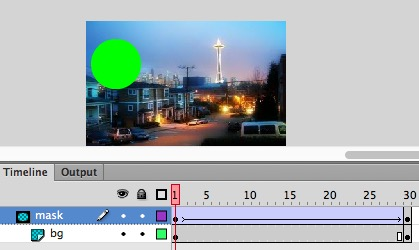

opengl渲染管线里, 在fragment shader之后, 写入frame buffer之前, 可以进行stencil test, 它可以剔除不要的像素, 依据是stencil buffer里对应的取值(1或者0).

对应这个功能, cocos2d-x里有一个clippingNode类, 我们可以设置它的模板(stencil), 那么它里面的子节点, 只有stencil覆盖范围内, 才会被渲染出来, 这就可以实现我们的遮罩功能了.

加入ClippingNode之后我们的渲染树如下:

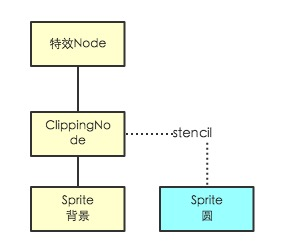

到这里为止我们已经基本了解动画特效的实现原理. 下面我们会对上面提到的5种属性做更深入的介绍.

## 八. 属性详细介绍

我们知道,在opengl的渲染, 本质上就是定义顶点的位置, 颜色, 纹理坐标, 然后进行绘制. 这里面顶点的位置(x,y) 是最基本的一个元素.

在我们实际的应用里, 图形可以**缩放, 旋转, 倾斜, 移动**,这些操作,本质上是对顶点进行位置的调整,  从数学上, 我们都可以归结为对顶点(x,y) 做矩阵乘法.

### 1. 缩放(scale)

缩放是最简单的, 就是把顶点的(x,y) 变成 

x = x * scaleX 

y = y * scaleY

这样的一种坐标变换, 我们可以用矩阵乘法来表达: 
$ \begin{bmatrix}scaleX  & 0 \\\\0 & scaleY\end{bmatrix}\begin{bmatrix}x   \\\\ y \end{bmatrix} = \begin{bmatrix}x\*scaleX   \\\\ y\*scaleY \end{bmatrix} $

所以, 缩放操作对应的变换矩阵为: $ \begin{bmatrix}scaleX  & 0 \\\\0 & scaleY\end{bmatrix} $

### 2. 旋转和倾斜(rotation/skew) 

旋转和倾斜本身是2种不同的变换, 这里放在这里一起讲,是因为flash编辑器里的skew其实是rotation的变种, 它不同于传统意义上的skew

#### 1). rotation 旋转

旋转比较好理解, 就是点(x,y) 围绕某点(通常是原点) 进行旋转, 关于点旋转有个数学公式(逆时针旋转A角度):

x = cosA * x - sinA * y

y = sinA * x + cosA * y

所以我们很容易得出旋转操作的变换矩阵为: $\begin{bmatrix}cosA & -sinA \\\\ sinA & cosA\end{bmatrix}$

#### 2). 传统意义的skew 倾斜

这里我们先看一下传统意义上的skew的含义:

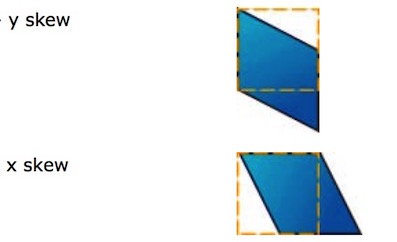

图里黄色虚线框是skew之前的图形,它原本是一个长方形, 

 * 在x方向上进行A角度的skew, 就相当长方形的4个顶点保持y坐标不变, 而x = x + y*tanA
 * 在y方向上进行A角度的skew, 就相当长方形的4个顶点保持x坐标不变, 而y = y + x*tanA

所以我们很容易得出倾斜操作的变换矩阵为: $\begin{bmatrix}1 & tan(skewX) \\\\ tan(skewY) & 1\end{bmatrix}$

#### 3). flash编辑器里的skew

经过一些测试, 我们可以发现flash里的skew其实是 rotation的变种.

我们可以推算出它的变换矩阵为: $\begin{bmatrix}cos(skewY)  & -sin(skewX) \\\\ sin(skewY) & cos(skewX)\end{bmatrix}$

也就是当skewX = skewY = A的时候, 你会发现它就等于旋转操作

 
### 3. 移动 (dx,dy)

#### 1) 坐标系的方向问题

flash编辑器里, y轴正方向是垂直向下的, 而opengl系的引擎比如cocos2d-x, 它的y轴是向上的, 这就需要flash里导出动画信息的时候, 如果是给cocos2d-x的引擎使用,需要把y坐标做一个翻转.

#### 2) 锚点问题

我们看一下上面动画例子里的底座在第一帧的信息:

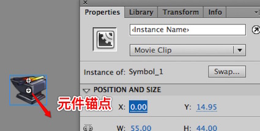

动画师在编辑元件的时候, 一般都会把元件的锚点定在图片内的某个位置,  这样方便后面做旋转缩放,flash里元件的(x,y), 其实就是元件锚点的(x,y).

所以如果在cocos2d-x里, 把图片创建出来成Sprite之后, 默认锚点是在图片正中间, 需要重新设置图片的锚点为当时flash里元件的锚点位置, 这样才能保证(x,y)是正确的.

#### 3) 变换矩阵

我们知道移动之后,  

y = y + dy

x = x + dx

我们会发现我们无法用之前的2维矩阵来表示这种变换, 我们需要把我们之前的2维矩阵扩展成3维:

$$ 
\begin{bmatrix}1  & 0 & dx \\\\ 0 &  1 & dy \\\\ 0 & 0 & 1  \end{bmatrix}\begin{bmatrix}x   \\\\ y \\\\  1 \end{bmatrix} = \begin{bmatrix}x + dx   \\\\ y + dy \\\\ 1  \end{bmatrix} $$

同理, 为了统一, 我们回头把我们上面提到的缩放,旋转,倾斜的2维矩阵也扩展成3维的, 只需要右下角填充1, 其他位置填充0即可.

到这里为止,  缩放, 旋转,倾斜, 平移, 这些操作我们称之为 ***仿射变换(Affine Transformation)***

### 4. 多个矩阵相乘

我们对一个顶点同时做缩放, 旋转, 等多个操作,  其实相当于就是对这个顶点做几次矩阵乘法, 因为一般来说图形会有多个顶点,  对每个顶点都做这个计算会比较浪费, 我们可以先把这些矩阵先提前相乘, 最后把结果再统一跟所有顶点做一次矩阵乘法即可.

同时需要注意, cocos2d-x等引擎都会有渲染树的概念, 也就是图形可以是另外一个图形的子节点, 那么在实际渲染子图形的时候, 需要依次取得到根节点的所有变换矩阵,  全部进行相乘, 才可以正确的渲染.

### 5. 透明度(alpha)

#### 1) alpha用在什么地方

我们可以对显示对象设置alpha值, 显示对象的纹理本身每个坐标对应的像素也有自己的alpha值, 最终2个alpha值会相乘得到这个显示对象某点坐标的最终alpha值.

alpha值它可以用在alpha test, 或者一些shader中作为某种特殊输入, 更多的, 它可以用于绘制最后一步上: 写入frame buffer. 

这一步我们叫做blend, blend公式是可以选择的,

大多数情况下, 写入公式为:

src为本图形某像素点的颜色

dest为目标像素点的原来颜色

新颜色 = src.rgb *  src.alpha + dest.rgb*(1-src.alpha )

我们可以调整blend方法来修改这个默认公式.

#### 2) pre-multipled alpha

我们看看上面这个公式里src.rgb * src.alpha, 我们可以把这个计算优化掉, 让图片在导出的时候, 就让它每个像素的rgb 都乘以alpha(这个过程叫alpha premultipled), 这样虽然导出来的图片会有点怪, 但是在游戏渲染的时候, 我们可以告诉它我们这个纹理已经是预先乘过alpha了, 你在blend的时候就可以少做一些乘法运算了.  

通过这个办法我们可以提高一些渲染性能.

premultiple alpha还有一些其他的好处, 比如可以统一blend模式方便batch渲染, 颜色线性插值计算时不会因为alpha的差异过大导致出现奇怪的边缘等问题.

### 6. 颜色(color)

我们看一下flash编辑器里的颜色编辑:

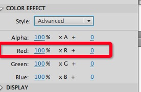

颜色效果这里, 有2个部分,  一个是RGB分量, 一个是RGB的绝对值叠加, 

RGB分量部分可以通过给顶点设置颜色(setColor) 实现,

而RGB绝对值叠加部分会有点麻烦, 一般我们需要通过写一个fragment shader来进行颜色分量的叠加,  而且还需要考虑父节点的颜色叠加效果 跟  子节点的颜色叠加效果需要做一个加法.

<!--导出工具要解决的问题

1. 图片导出,打包问题

属性嵌套问题
-->
