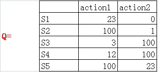
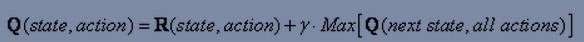

<!--
author: luodx
date: 2014-01-20 
title: 关于Q-learning(附上练习示例) 
status: publish
--> 
今天有人在微博贴了一个这个 http://sarvagyavaish.github.io/FlappyBirdRL/

大意就是(sarvagyavaish)在玩flappy bird, 他想写一个类似按键精灵的脚本, 采用Q-learning, 来让小鸟自动闯关. 由于手机上截图耗时久, 没法采集到 输入跟状态变化的对应关系, 于是利用了一个开源的JS版本的flappy bird , 来里面植入自己的训练代码, 这样来实现目的.

然后我去看了些文档学习了一下<strong>Q-learning</strong>.

http://artint.info/html/ArtInt_265.html

http://people.revoledu.com/kardi/tutorial/ReinforcementLearning/index.html

(这里只是写一下我的学习理解, 可能有错误的地方..)

机器人要做决策, 它首先要明白当前所处的状态, 然后在可选的几个动作里选择一个去操作, 接着进入下一个状态. 所谓Q-learning, 就是通过不断的尝试, 慢慢的生成一个数组Q, 这个Q是给机器人决策提供一个依据:

行S1,S2,S3等表示的是状态, action1, action2表示的可选动作

在某个状态S下, 采用某个action, 对进入最终目标状态的帮助大小, 我们用一个数字来表示. 图中Q(S1, action1) = 23.

一开始Q是一个空集,当随着尝试和Learning, Q数组比较稳定之后就可以拿来做决策参考了, 机器人在某个状态下只需要查表, 选择数字大的那个action进行操作就可以了.

Q-learning的过程,就是完善Q数组的过程.

首先我们需要对游戏状态进行定义, flappy bird这个游戏里, 去掉一些固定不变的因素(水管高度,宽度, 水平移动速度等), 状态可以抽象为4个因素, 小鸟跟下一个水管顶部的水平距离, 小鸟跟下一个水管顶部的竖直距离, 小鸟是否死亡, 小鸟竖直速度.

(在sarvagyavaish的例子里, 他把小鸟竖直速度给去掉了, 这个我觉得会对决策准确性产生一些负面影响, 但是由于状态少了一个维度, 可以大大减少生成Q需要的训练次数)

在任何状态下, 可选的操作就2个,

action1: 什么都不做
action2: 模拟点击, 小鸟向上飞一下

在训练的时候, 随便选一种action进行操作, 然后对它进行评价, 如果操作了之后, 小鸟没有死掉, 那么我们姑且认为此次操作可以获得 1点 reward, 如果小鸟死掉了, 那么我们认为此次操作 获得 -1000点reward, 接着我们使用以下公式对Q进行填表

上图中R就是reward, γ 是一个0到1的衰减参数, Max(Q(nextState, allActions)) 是指,如果经过此次action过后进入nextState之后, nextState的所有可选actions里, 最大的那个Q是多少.

也就是这个公式想表达 Q(state,action)的取值, 不仅要考虑此次操作可以直接获得的reward, 同时还要考虑后继状态对 达成最终状态的一个影响, 这个权重多大就看γ的取值了, sarvagyavaish例子里, γ取值为0.7

在计算 Q(state,action)的时候, 需要计算 Max(Q(nextState, allActions)), 如果以前从来没进入过nextState, Max()返回的必定是0, 但是如果以前进入过NextState,那么Max()返回的不一定是0了, 所以, state跟nextState哪个先进入, 是会影响现在这个Q的取值的, 只不过当随着训练次数足够, Q的取值也会趋向稳定.

实际上上述公式还不完整, 这个公式里其实还有一个参数α没写出来, 这个参数主要影响在给Q填表的时候, 对Q的历史取值是否要做一个衡量, 完整公式应该是:

Q(state, action) = Q(state, action)上次取值 * (1-α) + α* 此次计算出来的Q(state, action)

在sarvagyavaish例子里, α取值为1, 也就是不考虑Q的历史取值.

另外 sarvagyavaish 只是为了实践一下Q-learning, 实际上如果能取到游戏里 小鸟的状态数据(包括竖直速度), 直接通过物理公式计算可以写一个更精准的AI.

-------------

<strong>下面是一个实例练习</strong>

我设定了一个迷宫地图， 最终目标是要走到右上角的目标点。

首先， 是定义游戏状态，这个很简单， 当前走到某个格子上， 这个就算一个状态， 也就是状态由当前的i（第几行）和j（第几列）决定

在某个状态下， 能选择的action最多就4种， 上下左右， 我用四个字符 u d l r 来表示。

这个例子我用as3实现了一遍， 方便在网页上做展示： （多点击几次 训练按钮 可以看到效果）

<object classid="clsid:d27cdb6e-ae6d-11cf-96b8-444553540000" width="540" height="450" codebase="http://download.macromedia.com/pub/shockwave/cabs/flash/swflash.cab#version=6,0,40,0">
<param name="loop" value="1" />
<param name="quality" value="high" />
<param name="scale" value="noborder" />
<param name="wmode" value="transparent" />
<param name="src" value="./img/2014/02/Qlearning.swf" />
<embed type="application/x-shockwave-flash" width="540" height="450" src="./img/2014/02/Qlearning.swf" wmode="transparent" scale="noborder" quality="high" loop="1"></embed></object>

点击 训练按钮，  程序便会随机选取某个点开始走迷宫， 直到走到终点或者无路可走， 这个过程中不断的修正Q数组的值， 从例子里可以看出来， 随着训练次数的增多， Q 数组会逐渐的完善起来， 等Q数组稳定下来后， 这个Q数组就可以用来做任意点走出迷宫的决策依据了。

这里是例子的源代码：

<a href="https://github.com/laomoi/CodeDisk/tree/master/as3/Qlearning/src">https://github.com/laomoi/CodeDisk/tree/master/as3/Qlearning/src</a>

